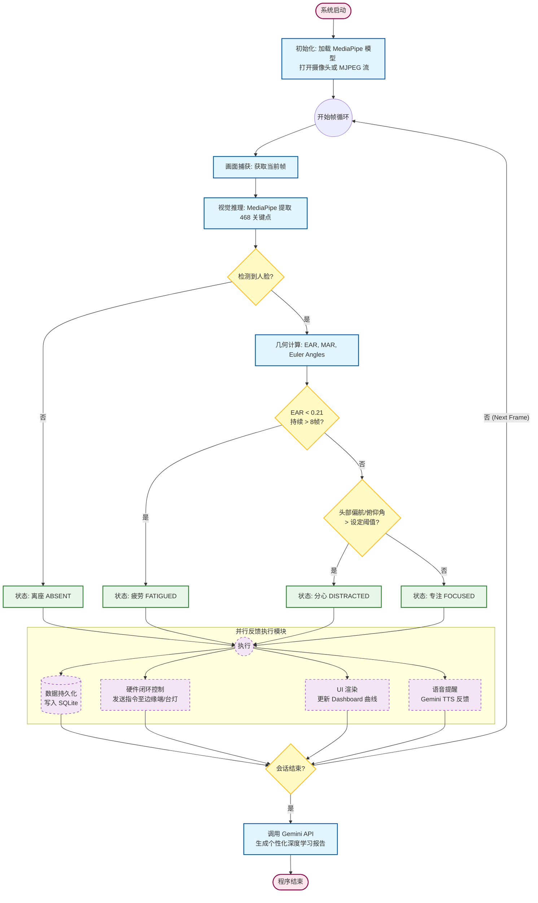

```mermaid
flowchart TD
    %% 节点样式定义
    classDef stateNode fill:#e1f5fe,stroke:#01579b,stroke-width:2px;
    classDef decision fill:#fff9c4,stroke:#fbc02d,stroke-width:2px;
    classDef action fill:#e8f5e9,stroke:#2e7d32,stroke-width:2px;
    classDef termin fill:#fce4ec,stroke:#880e4f,stroke-width:2px;
    classDef parallel fill:#f3e5f5,stroke:#7b1fa2,stroke-width:1px,stroke-dasharray: 5 5;

    %% --- 第一阶段：系统初始化 ---
    Start([系统启动]):::termin --> Init[初始化: 加载 MediaPipe 模型 <br/> 打开摄像头或 MJPEG 流]:::stateNode
    Init --> LoopStart((开始帧循环))

    %% --- 第二阶段：视频帧采集与推理 ---
    LoopStart --> Capture[画面捕获: 获取当前帧]:::stateNode
    Capture --> Inference[视觉推理: MediaPipe 提取 468 关键点]:::stateNode
    Inference --> HasFace{检测到人脸?}:::decision

    %% --- 第三阶段：状态机判定逻辑 ---
    HasFace -- 否 --> StateAbsent[状态: 离座 ABSENT]:::action
    HasFace -- 是 --> Calc[几何计算: EAR, MAR, Euler Angles]:::stateNode
    
    Calc --> CheckFatigue{EAR < 0.21 <br/>持续 > 8帧?}:::decision
    
    CheckFatigue -- 是 --> StateFatigue[状态: 疲劳 FATIGUED]:::action
    CheckFatigue -- 否 --> CheckDistraction{头部偏航/俯仰角 <br/> > 设定阈值?}:::decision
    
    CheckDistraction -- 是 --> StateDistract[状态: 分心 DISTRACTED]:::action
    CheckDistraction -- 否 --> StateFocused[状态: 专注 FOCUSED]:::action

    %% --- 第四阶段：并行反馈执行 ---
    %% 汇聚所有状态
    StateAbsent --> FeedbackStart
    StateFatigue --> FeedbackStart
    StateDistract --> FeedbackStart
    StateFocused --> FeedbackStart

    subgraph ParallelExec [并行反馈执行模块]
        direction TB
        FeedbackStart((执行)):::parallel
        
        FeedbackStart --> DB[(数据持久化<br/>写入 SQLite)]:::parallel
        FeedbackStart --> HW[硬件闭环控制<br/>发送指令至边缘端/台灯]:::parallel
        FeedbackStart --> UI[UI 渲染<br/>更新 Dashboard 曲线]:::parallel
        FeedbackStart --> TTS[语音提醒<br/>Gemini TTS 反馈]:::parallel
    end

    %% --- 第五阶段：迭代与结束 ---
    DB & HW & UI & TTS --> CheckEnd{会话结束?}:::decision
    
    CheckEnd -- 否 (Next Frame) --> LoopStart
    CheckEnd -- 是 --> GenerateReport[调用 Gemini API<br/>生成个性化深度学习报告]:::stateNode
    GenerateReport --> End([程序结束]):::termin
```